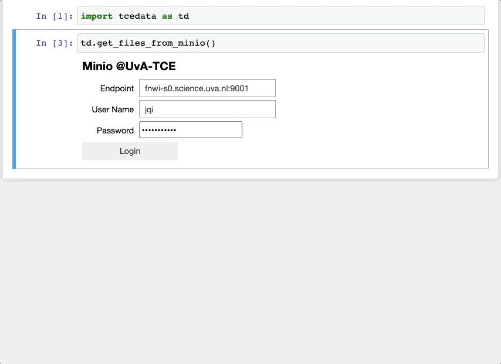

# TCEData
Tools to download data from storages hosted by UvA-TCE to user workspace.

**Note: if you run TCEData on a machine connected to UvA network or a virtual machine on SURF Research Cloud (SRC), you don't need VPN. Otherwise, you need to firstly connect to the UvA VPN.**

## Usage
Login to UvA-TCE MinIO server:


Download files:


## Install
Using Anaconda:

```shell
conda config --add channels conda-forge
conda config --set channel_priority strict
conda create -n <name-of-your-env> python=3.8  # to install Meteovis to a new environment
conda activate <name-of-your-env>
conda install -c jiqi tcedata
```

When installing into JupyterLab 1 or 2, you may also need to install the labextensions if you have never done so before:

```shell
jupyter labextension install @jupyter-widgets/jupyterlab-manager
```

For now, TCEData is only available on AMD64 Linux systems, with Python@3.8.